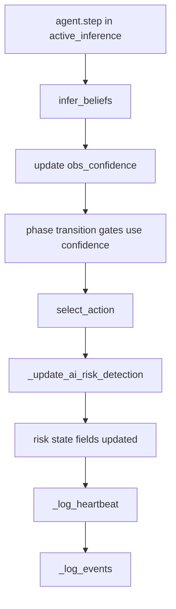
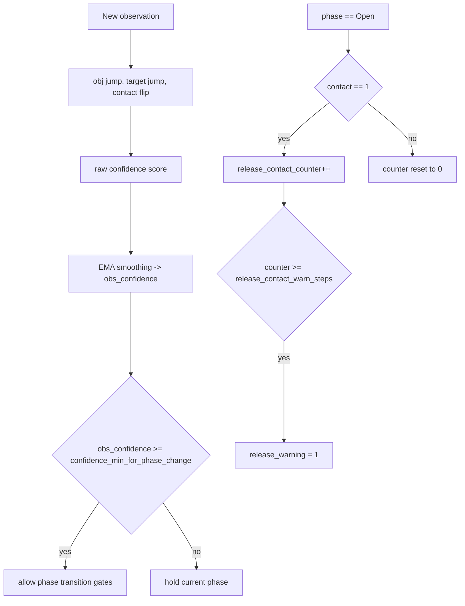
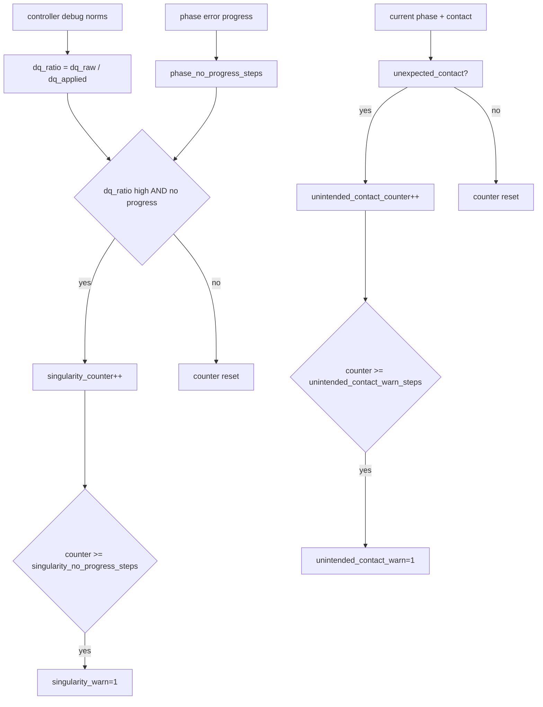

# Active-Inference + BT Architecture

## Goal
Use a Behavior Tree (BT) as a high-level supervisor and active-inference as the low-level action policy for pick-and-place.

## Current Design (Implemented)

### BT Scope
- Runtime is active-inference only.

### BT Structure
- Root: `Selector`
- Child 1: `Sequence(Acquire, Place)`
- Child 2: `Recover`

### BT Node Meaning
- `Acquire`: object acquisition pipeline is running or finished.
- `Place`: post-lift placement pipeline is running or finished.
- `Recover`: request reset-to-reach when phase progression fails.

### Active-Inference Phase Pipeline
1. `Reach`
2. `Align`
3. `PreGraspHold`
4. `Descend`
5. `CloseHold`
6. `LiftTest`
7. `Transit`
8. `MoveToPlaceAbove`
9. `DescendToPlace`
10. `Open`
11. `Retreat`
12. `Done`

### Transition Quality Gates
- Reach/descend gates use configured thresholds and timers.
- Place-open gate is strict axis-based:
  - `place_xy_ok AND place_z_ok`
- BT stall detection is progress-aware:
  - checks phase error improvement, not only raw time in phase.

### Recovery Behavior
- On BT recovery request:
  - phase is reset to `Reach` for pick-side failures
  - place-side alignment failures can re-enter `MoveToPlaceAbove` when grasp is still retained
  - key timers/counters are reset
  - cooldown is applied
  - retry count increments
- If retries exceed configured limit:
  - phase set to `Failure`

## Data Flow
1. Sensor observation (`o_ee`, `o_obj`, `o_target`, `o_grip`, `o_contact`).
2. `infer_beliefs(...)` updates:
   - `s_ee_mean`, `s_obj_mean`, `s_target_mean`, phase state, timers.
3. BT ticks on current belief:
   - keep running, recover, or terminal.
4. `select_action(...)` outputs control command for current phase.
5. Controller + safety checker execute command.

## Failure Detection Flow (Current)
This is the current detect-only monitoring path for active-inference runtime.

### Detection Pipeline (Per Step)

### Confidence and Release Verification

### Risk Detection (Detect-Only)

### Important Note
- Current behavior is detect-only.
- No forced emergency transition is triggered from these warnings.
- Warnings are surfaced in heartbeat/event logs for analysis and later recovery policy design.

## What Is Still Missing for Real-Robot Quality

### P0 (Most Important)
- Robust release success check:
  - after `Open`, verify object is no longer grasped and is stable near place target.
- Per-phase hard watchdog and fault reasons:
  - explicit reason tags for every retry/failure path.
- Better observability confidence gating:
  - do not transition on weak/noisy observations.

### P1
- Collision-aware and singularity-aware approach policy:
  - especially for side/behind-object geometry.
- Stronger grasp validation:
  - combine width, speed, contact, and object-relative motion.
- Automated benchmark harness for active-inference:
  - batch runs, randomized objects/poses, failure taxonomy.

### P2
- Full BT mission library:
  - regrasp branch, skip/fail-safe branch, human-interrupt branch.
- Domain randomization and sim-to-real calibration:
  - friction, delay, noise, compliance.
- Hardware abstraction hardening:
  - transport delays, dropped packets, actuator saturation handling.

## Recommended Next Work Order
1. Add release verification node/check after `Open`.
2. Add active-inference benchmark script with summary metrics.
3. Add confidence gating around phase transitions.
4. Add collision/singularity fallback branch in BT.
5. Start hardware-in-the-loop timing and latency tests.
