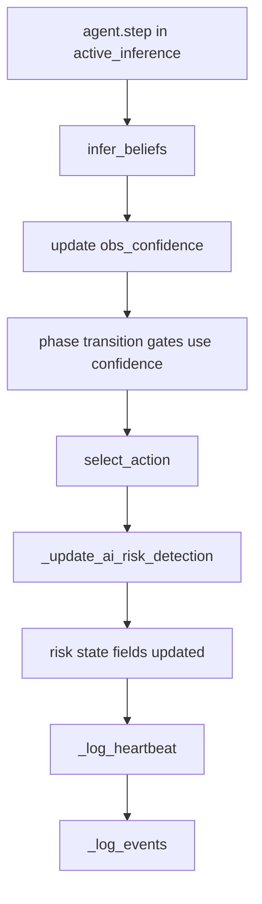
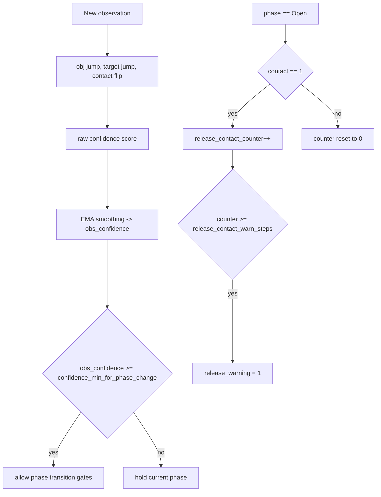
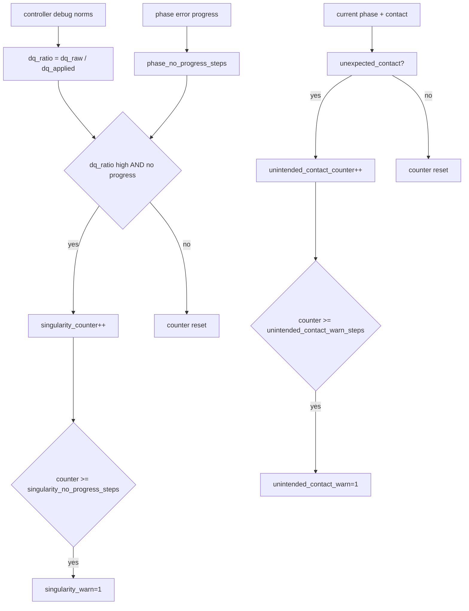

# AI Failure Detection Flow

This is the current detect-only failure monitoring path for active-inference mode.

## 1) Detection Pipeline (Per Step)

## 2) Confidence + Release Verification

## 3) Risk Detection (Detect-Only)

## 4) Important Note

Current behavior is detect-only:
- No forced emergency transition is triggered from these warnings.
- Warnings are surfaced in heartbeat/event logs for analysis and later recovery policy design.

