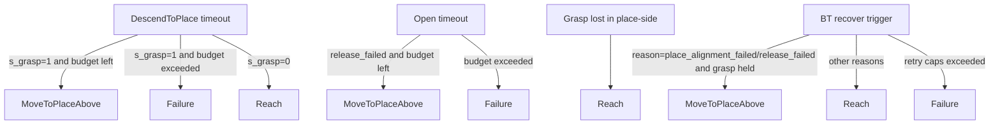
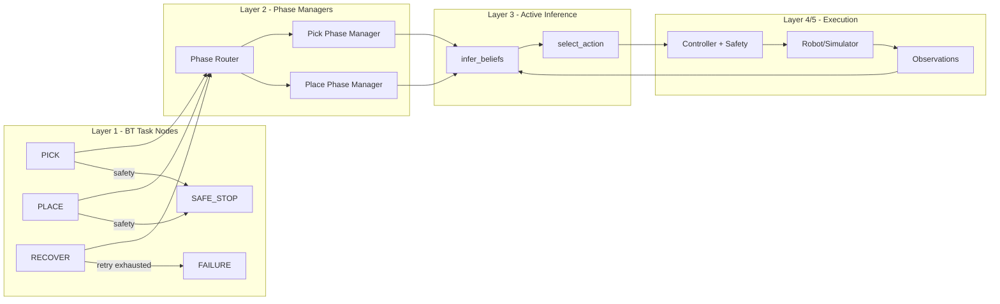
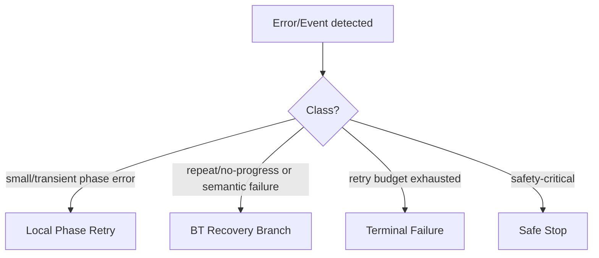
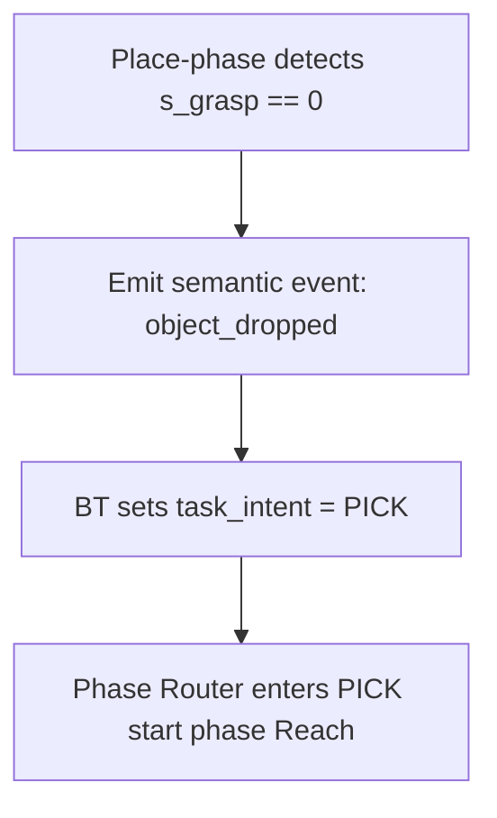

# Architecture Graphs: Current vs Hybrid (Discussion Pack)

Last updated: 2026-03-12
Purpose: Visuals to discuss retry/recovery/failure ownership and routing.

## 1) Current Runtime (What is running now)

```mermaid
flowchart LR
  subgraph L1[Layer 1 - BT Supervisor (current)]
    BT[BT Tick]
    BTR[Recover Belief]
  end

  subgraph L2[Layer 2 - Unified Phase Machine (current)]
    R[Reach] --> A[Align] --> D[Descend] --> CH[CloseHold] --> LT[LiftTest]
    LT --> T[Transit] --> MPA[MoveToPlaceAbove] --> DTP[DescendToPlace] --> O[Open] --> RT[Retreat] --> DN[Done]
  end

  subgraph L3[Layer 3 - Active Inference]
    IB[infer_beliefs]
    SA[select_action]
  end

  subgraph L4[Layer 4 - Control]
    CTRL[Controller + Safety]
  end

  subgraph L5[Layer 5 - Plant]
    SIM[Robot/Simulator]
    OBS[Sensor Observation]
  end

  OBS --> IB --> BT
  BT -->|normal| SA
  BT -->|recover| BTR --> SA
  SA --> CTRL --> SIM --> OBS
```

Key point:
1. Phase transitions are still primarily in `inference_interface.py`.
2. BT recovery also modifies phase on recovery.
3. This is why ownership feels mixed today.

---

## 2) Current Retry/Recovery Routing (Important)



Key point:
1. Yes, place-side can retry via `MoveToPlaceAbove`.
2. Grasp loss in place-side returns to `Reach` through BT task-switch event `object_dropped` (re-pick path).
3. Current runtime resets retry budget on this explicit task switch (`retry_count=0`).

---

## 3) Recommended Hybrid (Target)



Key point:
1. BT decides task intent.
2. Phase managers decide phase transitions.
3. Active inference stays action/belief engine.

---

## 4) Error-Handling Strategy: What is better?

Short answer: **hybrid is best**.



Why hybrid:
1. Local retry is fast and phase-aware.
2. BT recovery is shared/semantic and reason-driven.
3. Safety and hard-fail remain universal.

---

## 5) Practical Rule Set (Recommended)

1. Keep local phase retries for near-goal or short stalls.
2. Use BT recovery for repeated failures (`reach_stall`, `place_alignment_failed`, `release_failed`, `object_dropped`).
3. Route any place-side grasp loss as event `object_dropped` and switch task intent to `PICK` (router then starts `Reach`).
4. Keep retry budgets centralized in BT, with explicit reset on task switch (`object_dropped`).
5. Keep safety stop universal and highest priority.

---

## 6) Error-Class Mapping Table (Design Lock)

| Event / Error | Detected In | Class | Owner of Decision | Action |
|---|---|---|---|---|
| Small phase threshold miss (near-goal) | Phase manager | local_transient | Phase manager | Local phase retry / keep phase |
| `reach_stall` repeated | Phase manager / BT watchdog | semantic_repeat | BT | `RECOVER` branch (`ReApproachOffset` first) |
| `place_alignment_failed` repeated | Phase manager / BT watchdog | semantic_repeat | BT | `RECOVER` branch, usually resume place via `MoveToPlaceAbove` |
| `release_failed` repeated | Phase manager / BT watchdog | semantic_repeat | BT | `RECOVER` branch, re-approach place then retry release |
| `object_dropped` (`s_grasp==0` in place task, except after valid open success) | Phase manager | task_switch | BT | Switch to `PICK` task intent (router enters `Reach`) |
| Retry budget exhausted | BT | terminal | BT | `FAILURE` |
| Safety-critical condition | Safety / BT | safety_critical | BT | `SAFE_STOP` |

Notes:
1. Detection can happen in phase manager.
2. Task switch authority stays in BT.
3. This keeps one clear owner for mission-level decisions.

---

## 7) `object_dropped` Routing Contract



Rule:
1. Do not silently jump phase only.
2. Emit `object_dropped` event and let BT perform task switch.
3. Router starts pick pipeline from `Reach`.
4. Reset retry budget on this task switch so re-pick gets a fresh retry window.
