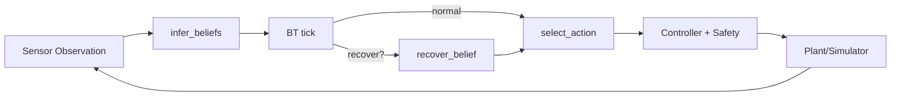
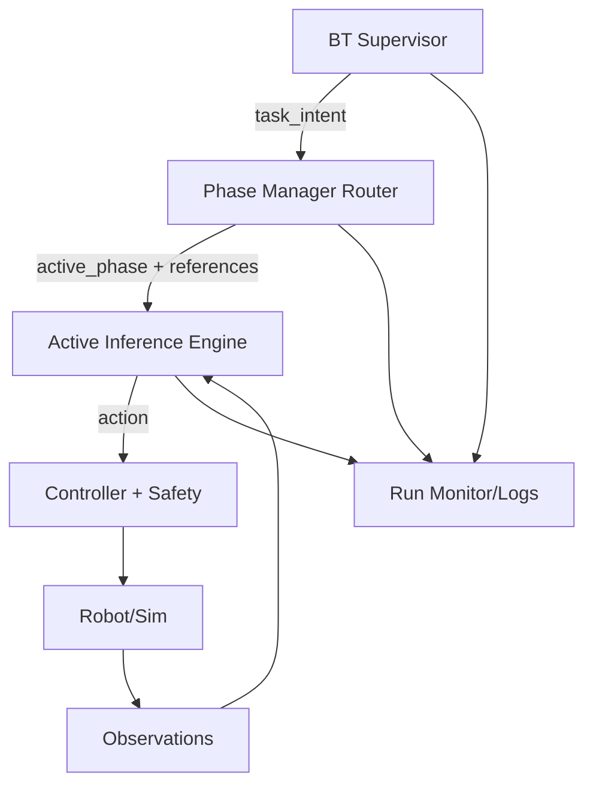
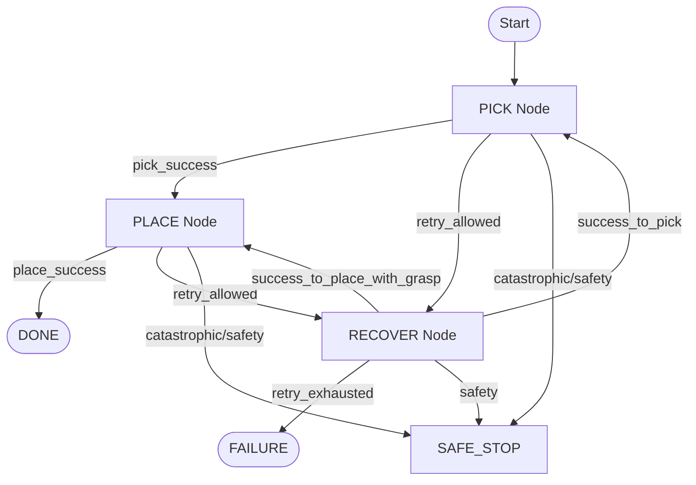
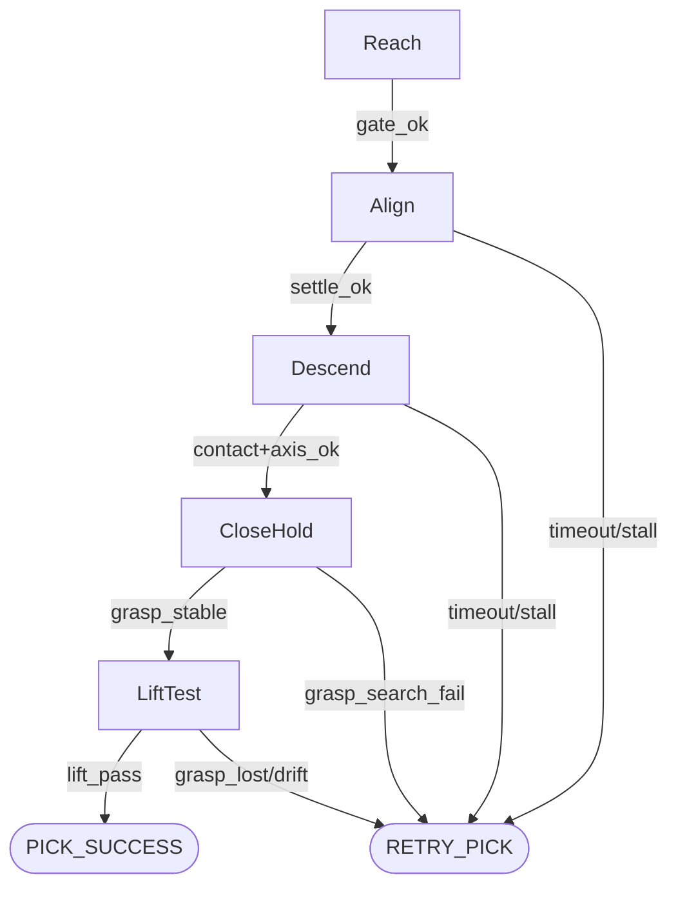
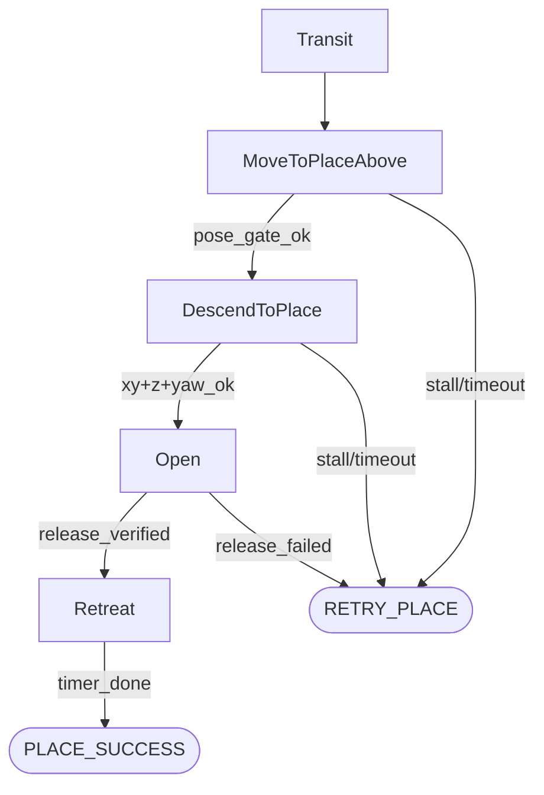
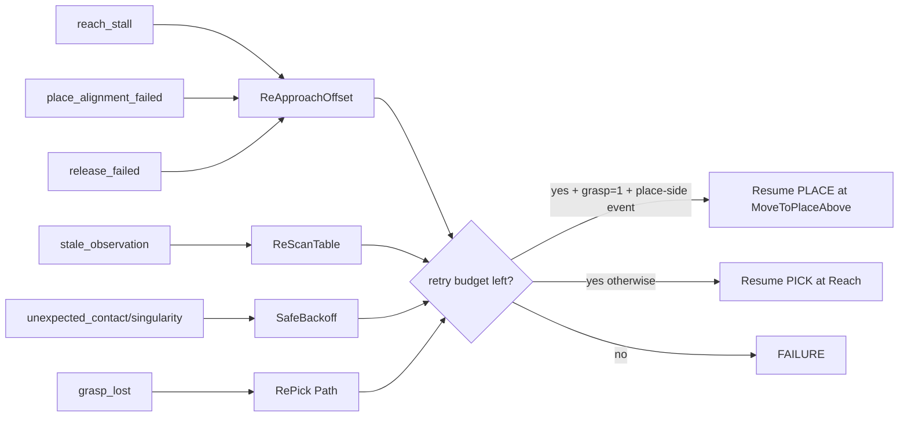
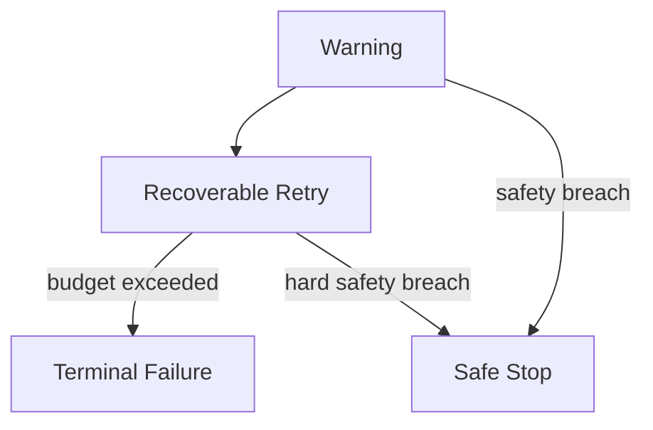
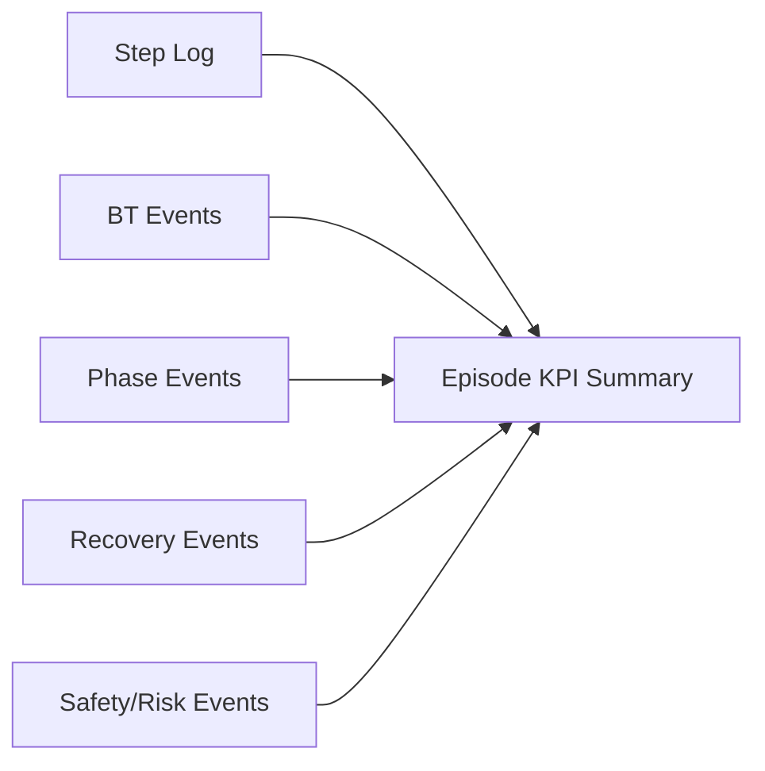

# BT + Phase Architecture Draft (Design Lock Before Refactor)

Last updated: 2026-03-12
Status: Draft with partial implementation (active runtime)

## Implemented Slice (Current Runtime)
1. Task-intent/BT decision observability is present in runtime logs.
2. Place-side grasp loss emits `object_dropped` and routes through BT task switch to pick entry (`Reach`).
3. Retry budget is reset on `object_dropped` task switch (`retry_count=0`).
4. Align yaw gate before descend is implemented with configurable threshold/hold.
5. EE yaw observation and controller yaw frame are aligned via runtime wiring (`yaw_axis`).
6. Place keepout no-reentry behavior is implemented in `MoveToPlaceAbove`/`DescendToPlace`.
7. Router/phase-manager scaffolding files exist, while primary phase transition logic remains in `inference_interface.py`.

## 1) Goal
Define a clear, debuggable runtime architecture where:
1. BT owns mission/task routing.
2. Pick/Place phase managers own phase transitions.
3. Active inference owns belief update and action selection.
4. Recovery and failure handling are explicit and observable.

This is a design-lock document before code refactor.

---

## 2) Current Runtime (As Implemented)

Notes:
1. This loop already exists and works.
2. Main pain point is ownership overlap: BT recovery and phase-local retry logic both influence flow.

---

## 3) Target Ownership Model (Recommended)

Ownership contract:
1. BT decides only `task_intent`: `PICK`, `PLACE`, `RECOVER`, `FAILURE`, `SAFE_STOP`.
2. Phase manager decides only phase progression within chosen task.
3. Active inference computes beliefs + action for current phase.
4. Controller/safety executes constrained motion.

---

## 4) BT Top-Level Graph (Task-Level Only)

Key rule:
1. BT never micromanages phase names like `Align` or `DescendToPlace`.
2. BT works at mission level only.

---

## 5) PICK Internal Phase Graph

---

## 6) PLACE Internal Phase Graph

---

## 7) Recovery/Fault Routing (Explicit Matrix)

---

## 8) Failure Severity Model

Severity guidance:
1. `Warning`: detect-only signals, continue.
2. `Recoverable Retry`: branch-based recovery.
3. `Terminal Failure`: retry budgets exhausted.
4. `Safe Stop`: safety-critical condition.

---

## 9) Interface Contracts (Needed Before Refactor)

BT output contract:
1. `task_intent` in `{PICK, PLACE, RECOVER, FAILURE, SAFE_STOP}`
2. `recovery_reason`
3. `recovery_branch`
4. `global_retry_count`

Phase manager output contract:
1. `active_phase`
2. `phase_status` in `{RUNNING, SUCCESS, RETRY, FAILURE}`
3. `retry_reason`
4. `has_object`

AI output contract:
1. `belief_state` (filtered state, confidence, VFE)
2. `action` (`move`, `grip`, optional objective flags)
3. `risk_flags`

---

## 10) Observability Graph (What To See Per Run)

Minimum end-of-run KPI block:
1. Final status (`Done`, `Failure`, `SafeStop`).
2. Retry counts by reason.
3. Recovery branch usage and success rate.
4. Hard-stuck counts by phase.
5. First-try pass rates for key transitions.

---

## 11) Incremental Migration Plan (No Big-Bang Rewrite)

1. **Step A: Design Lock**
Define and approve contracts in this doc.

2. **Step B: Add Task Intent Layer**
Keep behavior same; add explicit `task_intent` plumbing.

3. **Step C: Split Internal Managers**
Create `pick_phase_manager` and `place_phase_manager` wrappers that call existing logic.

4. **Step D: Move Transition Ownership**
Gradually move phase-transition rules from mixed locations into managers.

5. **Step E: Unify Recovery Routing**
Keep one authoritative retry routing path with clear budgets.

6. **Step F: Freeze and Benchmark**
Run scenario matrix and compare to baseline before further tuning.

---

## 12) Decision Items To Finalize Before Coding

1. Should `SafeStop` be BT terminal only, or also callable directly by phase manager?
2. Which layer is authoritative for retry budget checks (BT only recommended)?
3. Should release verification be mandatory for `Open -> Retreat` in this cycle?
4. Do we expose both `phase` and `task_intent` in every CSV row (recommended: yes)?
5. Should place-side grasp loss be emitted as semantic event `object_dropped` and switched by BT to `PICK` intent (recommended: yes)?
