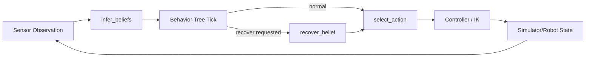
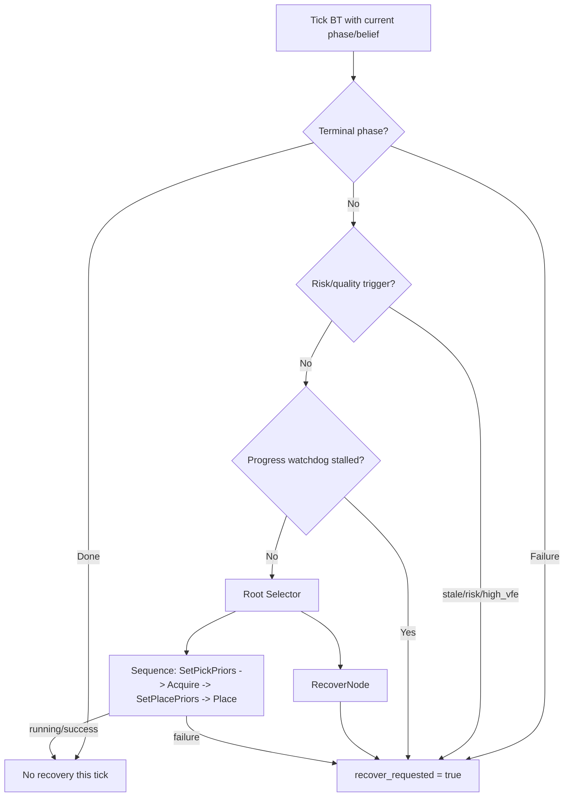
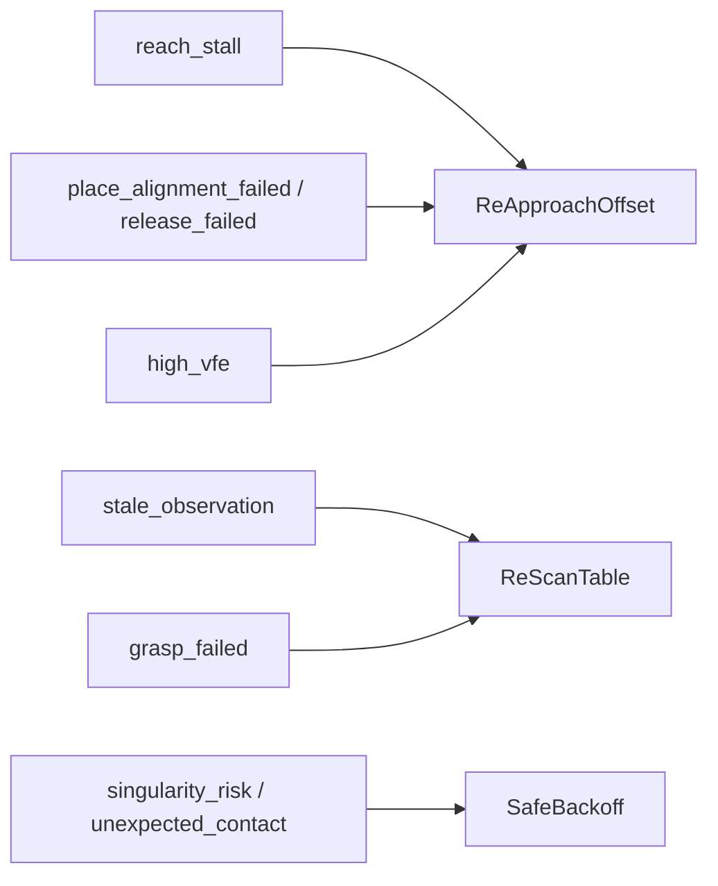
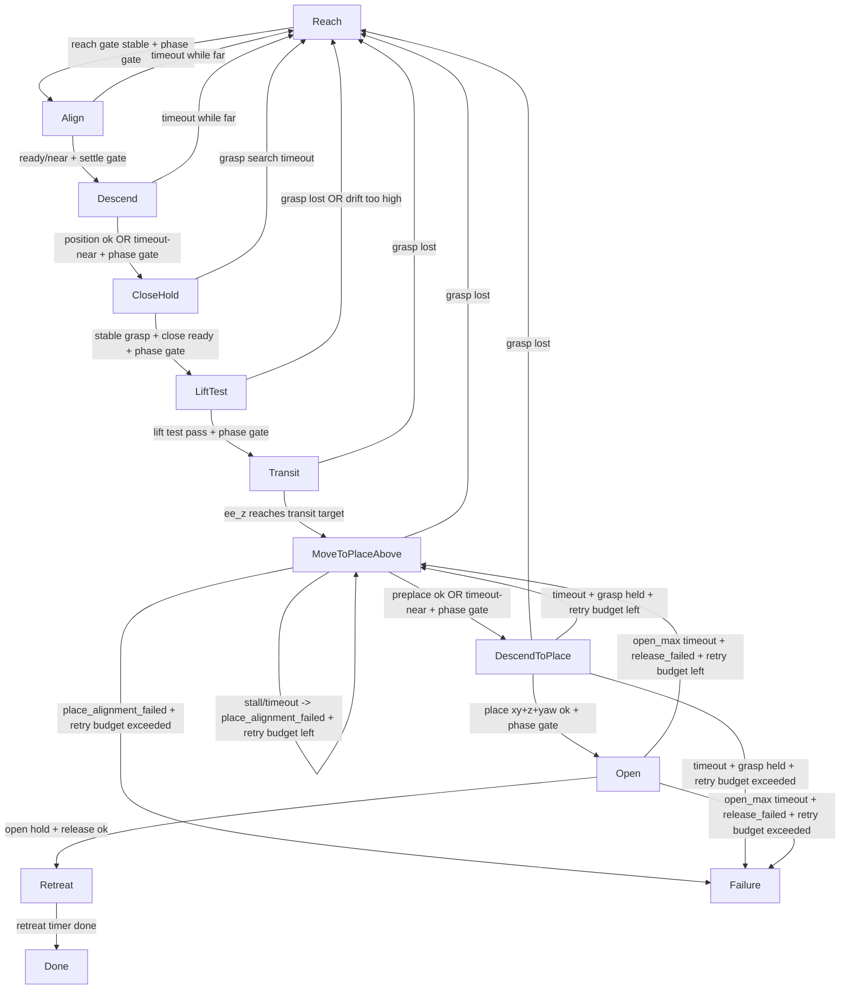

# Full High-Level Flow: BT + Phase Machine + Retry Paths

Last updated: 2026-03-04

Source files used:
- `agent/ai_behavior_tree.py`
- `inference_interface.py`
- `inference/action_selection.py`

This diagram set shows:
1. How BT supervises phase execution and recovery.
2. Full phase-state machine transitions.
3. Exactly where failures go (retry, fallback, or terminal failure).

---

## 1) Runtime Control Stack (High Level)

---

## 2) BT Logic and Recovery Routing

### 2.1 BT decision path

### 2.2 Recovery reason -> preferred branch order

Notes:
- If preferred branch cap is reached, next branch is tried.
- If all branches are exhausted, BT returns terminal failure path.
- Retry caps apply in `recover_belief`:
  - `max_retries`
  - `global_recovery_cap`

---

## 3) Full Phase-State Machine with Retry/Fallback Paths

---

## 4) What Happens When BT Recovery Triggers

When BT triggers recovery (`recover_belief`):

1. If reason is place-side (`place_alignment_failed` or `release_failed`) and:
- current phase is place-side, and
- grasp is still held

Then BT forces:
- phase -> `MoveToPlaceAbove`
- resets place-side timers/counters

2. Otherwise BT forces:
- phase -> `Reach`
- resets pick/place timers and watchdog counters
- applies selected recovery branch prior offsets/boost

3. Hard failure conditions in BT:
- `retry_count > max_retries`
- `global_recovery_count > global_recovery_cap`
- no recovery branch available under branch caps

All of these go to phase `Failure`.

---

## 5) Quick Edge Summary (fail -> where)

- `Align` fail -> `Reach` (`reach_stall`)
- `Descend` fail -> `Reach` (`grasp_failed`)
- `CloseHold` fail -> `Reach` (`grasp_failed`)
- `LiftTest` fail -> `Reach` (`grasp_failed`)
- `Transit` grasp loss -> `Reach` (`grasp_failed`)
- `MoveToPlaceAbove` fail -> self-retry or `Failure` (`place_alignment_failed`)
- `DescendToPlace` fail -> `MoveToPlaceAbove` or `Reach` or `Failure`
- `Open` fail -> `MoveToPlaceAbove` or `Failure` (`release_failed`)
- Any BT hard-limit breach -> `Failure`
