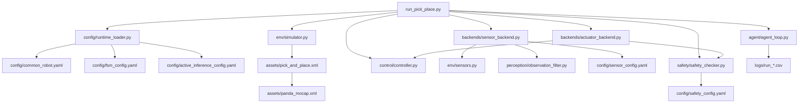
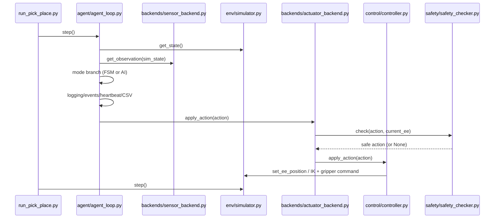
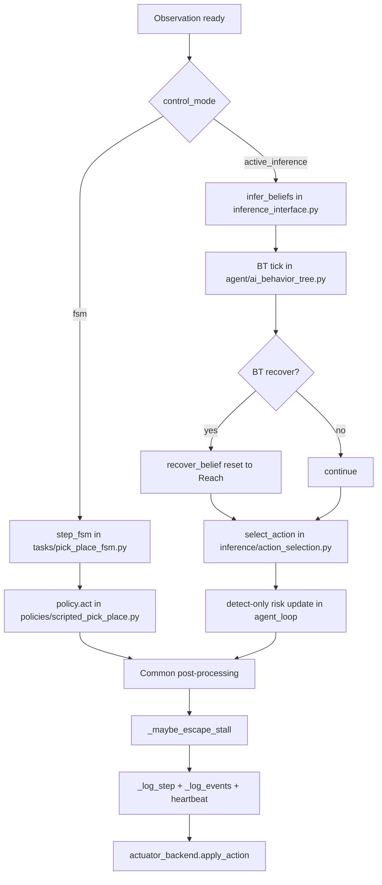
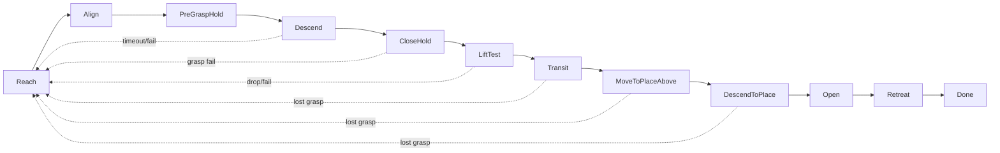

# Runtime System Flow

This doc shows how the current code runs end-to-end, which files call which files, and how data moves in both `fsm` and `active_inference` modes.

## 1) Top-Level Startup Flow

## 2) Main Runtime Loop (Per Step)

`run_pick_place.py` loop:
1. `agent.step()`
2. `agent.is_terminal()` check
3. `simulator.step()`
4. sleep `0.02` (about 50 Hz)

## 3) Mode Branch Inside `agent.step()`

## 4) Active-Inference Phase Flow

Main phase path currently used by AI mode:

Notes:
- BT supervises this flow and can request reset/retry when progress stalls.
- Risk detection is detect-only now (warning logs, no forced branch).

## 5) FSM Phase Flow (Reference)

FSM mode uses `tasks/pick_place_fsm.py` and `policies/scripted_pick_place.py`.

For full FSM diagram, see:
- `docs/fsm_state_flow_diagram.md`
- `docs/fsm_phase_behavior.md`

## 6) Data Contracts

### Observation dict (sensor -> agent)
- `o_ee`: end-effector world position (with sensor noise)
- `o_obj`: object relative vector (EE frame)
- `o_target`: place target relative vector (EE frame)
- `o_grip`: gripper opening width
- `o_contact`: object-gripper contact flag
- `o_obj_yaw`: object yaw

### Belief dict (AI mode)
Built in `inference_interface.py`, includes:
- state means: `s_ee_mean`, `s_obj_mean`, `s_target_mean`
- phase state/timers
- confidence state: `obs_confidence`
- release verification state: `release_contact_counter`, `release_warning`

### Action dict (agent -> actuator)
- motion: `move` or `ee_target_pos`
- grip: `grip` (`1` close, `-1` open, `0` hold)
- optional orientation flags:
  - `enable_yaw_objective`
  - `yaw_target`
  - `yaw_pi_symmetric`
  - `enable_topdown_objective`

## 7) File-to-File Call Path

| Caller | Calls | Why |
|---|---|---|
| `run_pick_place.py` | `load_runtime_sections` | Strict config load/validation |
| `run_pick_place.py` | `MujocoSimulator` | Sim world/model lifecycle |
| `run_pick_place.py` | `EEController` | Low-level command execution |
| `run_pick_place.py` | `ActiveInferenceAgent` | Main decision loop owner |
| `ActiveInferenceAgent.step` | `SimSensorBackend.get_observation` | Get filtered observation |
| `ActiveInferenceAgent.step` (FSM) | `step_fsm` + `ScriptedPickPlacePolicy.act` | FSM decision path |
| `ActiveInferenceAgent.step` (AI) | `infer_beliefs` + `AIPickPlaceBehaviorTree.tick` + `select_action` | AI decision path |
| `SimActuatorBackend.apply_action` | `SafetyChecker.check` | Enforce motion safety before control |
| `SimActuatorBackend.apply_action` | `EEController.apply_action` | Execute final safe action |
| `EEController.apply_action` | `MujocoSimulator` methods | Drive EE and gripper in sim |

## 8) Where "Model" Logic Lives

There are multiple model layers:

1. **Physics model**: MuJoCo XML scene and robot (`assets/*.xml`)  
2. **Belief model**: phase/belief update logic (`inference_interface.py`)  
3. **Action-selection model**: EFE-style chooser (`inference/action_selection.py`, optional Julia bridge in `inference/action_selection.jl`)  
4. **Execution model**: IK + constraints (`control/controller.py`)  
5. **Safety model**: bounds and action validation (`safety/safety_checker.py`)  

